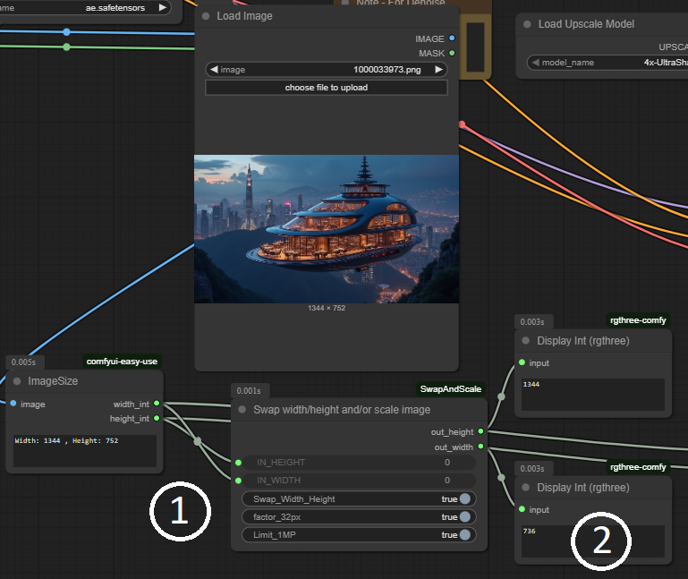
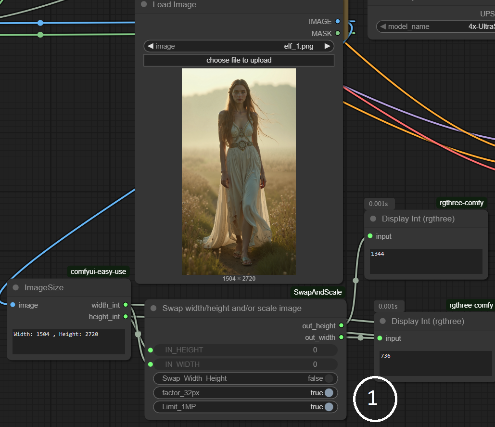

# ComfyUI_Swap_and_Scale <br />

---

## ✨ Features

- 🔗 Swap width with height
- Limit output widht and height to a total of 1 Megapixel (usefull for certain model)
- Resize width and height to factors of 32 which is usefull for new images, not so for existing.

---

## 🔧 Installation (Use ComfyUI customnode manager or clone this repo)

1. Clone or download this repo into your `ComfyUI/custom_nodes` directory:

```
cd /workspace/ComfyUI/custom_nodes
git clone https://github.com/MijnSpam/ComfyUI_SwapAndScale.git
```

2. Install dependencies:

```
none
```

3. Restart ComfyUI (or use the **Reload Custom Nodes** button if available).
4. Refesh browser.

---

## 🧩 How to Use

Add node to workflow and connect a widht and heigth to the field. 

In ComfyUI:


1. example explanation:
    - `1`: Swap Width_Height is on and as you see the out_height is swapped with the width.
    - `2`: example input image had dimensions 1344x752 >> 752 /32 = 23.5 and so with the factor_32px it's resize to 736.
    - `3`: Total pixels (W*H) is below 1024000 px so no scaling done

 
2. example explanation:
    - `1`: NO Swap Width_Height, however 1MP and factor32 is on. <br>
    Width 1504 / 32 = 47, Height 2720 / 32 = 85 >> ratio (w/h 0.552) scaled ratio 736 / 1344 = 0.547<br>
     _Not perfect but it respects the 1MP Limit with the 32px rule._

---


## 🧑‍💻 Contributing

Pull requests and feature ideas are welcome!  
Feel free to fork and create a PR.

---

## 📄 License

This project is licensed under the MIT License.  
See [LICENSE](./LICENSE) for details.
